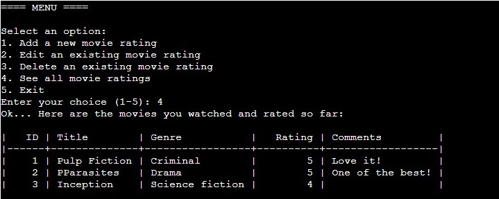

# My Movie Ratings

#### [Click to redirect to deployed app](https://my-movie-ratings.herokuapp.com)

My Movie Ratings is an app for tracking, rating and commenting movies and shows you have watched.

This is a terminal app, where you can Add your movie, Edit or Delete them, and view all movie entries to see what you watched.

## How to Use

- Go to https://my-movie-ratings.herokuapp.com and the app should be ready touse.
- To choose what to do in the app, you need to navigate in menu with options from 1 to 5.
- 

## Features

### Existing Features: 

- Menu

    - Menu acts as a point where users can choose what actions they need to complete
    - A short welcome message is displayed to show app name and its purpose
    - Navigation thru menu is done by inputting a number between 1 and 5.
    - Following actions are available in menu:
        - Add a new moview rating
        - Edit an existing movie rating
        - Delete an existing movie rating
        - See all movie ratings
        - Exit

- Adding Movie Rating
    - This feature allows users to input info about movie and store them in Google Sheet
    - Data is stored as table with following categoruies:
        - ID
        - Title
        - Genre
        - Rating
        - Comments
    - User is asked to input Title, Genre, Rating and Comments, while Comments is optional
    - Rating input must be an integer between 0 and 5
    - Also, some confirmation messages are displayed to let user know that action completed successfully

- Editing Movie Rating
    - This feature allows to edit the data already stored in Google Sheets, in case of user changed mind, or made a mistake
    - To make editing convenient, if users want to changed only a certain category they can easily skip a step by pressing Enter

- Deleting Movie Rating
    - In case user decided to remove existing data, this feature will allow user with ease to do so only by entering ID of the movie
    - For users convenience, table with existing movies displayed

- Seeing All Movies
    - Finally, users can see all entries they made. This way they can see and compare movies/shows they watched and rated

- Data Validations and Error Handling
    - Each input that made by a user is validated to make sure that correct data type and format are entered
    - In case, user entered wrong input they will see a message explaining what is wrong and how to fix

- Exiting the app
    - User has options to exit the app in the menu by choosing option 5

### Features to Consider:
- Add more visuals, such as, colors, ASCII art and etc.
- Add option to export the list of movies watched

## Data Model
For this project Google Sheets is used as app's database. The spreadsheet is divided into 5 columns for ID, Title, Genre, Rating and Comments.
Each row of the spreadsheet is meant to store data for one movie. Title, Genre, Rating and Comments are got from user inputs.
While ID is automatically assigned to each new data entry.

All further interaction with database is done by calling an ID of the movie. In order to edit or delete a movie rating, user has to provide its ID.

## Testing
- In order to identify existing bugs I manually tested the app
- Each input in the app tested using following methods considering each input's restictions
    - Entering valid integer in given range
    - Entering out of range integers
    - Entering a text
    - Entering decimals
    - Entering an empty input

### Bugs 

__Found and Fixed__
- Edit and Delete feature were not detecting last row of data
    - Solution: `worksheet.delete_rows(i+2)` - I added 2 for each iteration to take into account headers in the Google Sheet and 0-index.
- ID order would break if row of data is deleted in the middle of table
    - Solution: `update_ids()` - I created a function that iterates thru IDs and reassigns new IDs in order starting from 1. This function runs every time after movie is deleted.

__Existing and Not Fixed__
- Not observed any existing bugs that disrupts work of the app

### Validator test
- PEP 8 
    - Only one error was returned considering the length of the code in line 112. But it does not affect the app in runtime.

## Deployment
This project is deployed on Heroku using Code Institute Python template

- How to Deploy for your own Google Sheet spreadsheet:
    1. Clone or fork the repositoty
    2. Now you need to update credentials and Google Sheet info with your info:
        1. Create creds.json in repository
        2. Add you credentials to creds.json 
        3. In run.py, line 16 update: `SHEET = GSPREAD_CLIENT.open('`type your spreadsheet name`').worksheet('`type here your worksheet name`')`
        4. Save changes
    3. Create new app in Heroku
    4. In Heroku Settings tab:
        - Add Python and Node.js buildpack
        - Add Config Vars: `KEY: PORT; VALUE: 8000` and `KEY: CREDS; VALUE: "your .json credentials" `
    7. Link the repository to Heroku app
    6. Now click to Deploy under Deploy tab

## Credits

- Following sources were used in order to implement the project:
    - All info about how gspread is used were looked up at https://docs.gspread.org/en/latest/user-guide.html
    - Time delays were implemented with help of https://stackoverflow.com/questions/510348/how-do-i-make-a-time-delay
    - Using Google API to interact with Google Sheets were inspired by Code Institute coding challenge
    - In order to display table, tabulate is used and all guide is looked up at https://pypi.org/project/tabulate/

